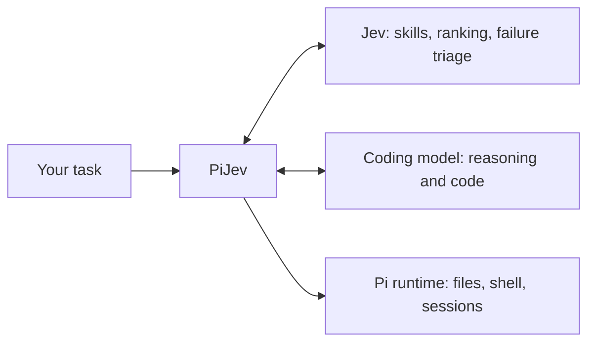
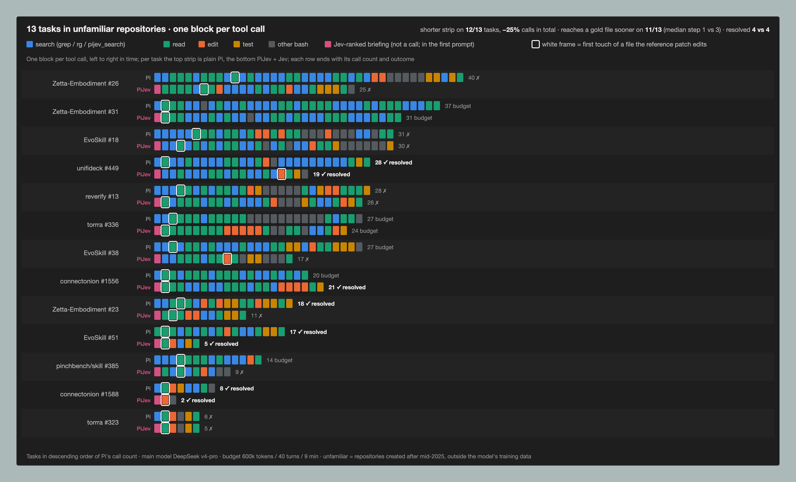
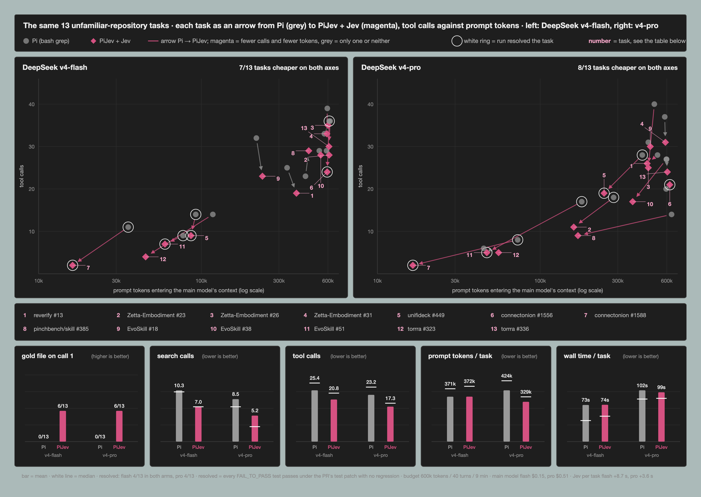
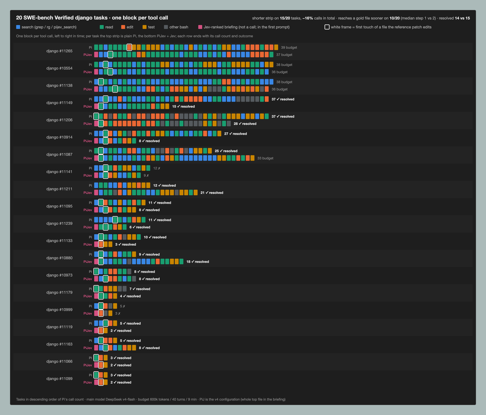

# PiJev

**A coding agent with Jev in the loop.**

[](https://github.com/tonyzdev/pijev/actions/workflows/ci.yml)
[](LICENSE)

English | [简体中文](README.zh-CN.md)

PiJev is a terminal coding agent built on [Pi](https://github.com/earendil-works/pi), with [Jev](https://typesafe.ai/) helping select skills, rank code excerpts, and diagnose tool failures. Your coding model handles reasoning, edits, and tool use. Jev evaluates small, typed questions along the way.

**Jev for decisions. Your coding model for code.**

```text
  PiJev  v0.1.0   Fast judgment. Deliberate code.
  Jev decisions · Pi execution · your coding model

  /pijev status & modes    /model coding model    /login connect
```

Early alpha. The integration is runnable, and real Jev access through Vercel Gateway has been verified. On SWE-bench django tasks and on repositories the model has never seen, PiJev makes fewer tool calls and reaches the right file sooner than plain Pi, at the same resolve rate; see [Evidence](#evidence) for the figure and the caveats, including cost.

## What Jev does

| In the coding workflow | Jev's role | What PiJev preserves |
| --- | --- | --- |
| Starting a task | Shortlist skills, then check their instructions for relevance | The full skill roster and explicit user selections |
| Finding code | Rank actual file excerpts retrieved by `pijev_search` | Exact paths, line numbers, source text, and retrieval limits |
| Investigating a failed tool | Classify the failure and suggest what to check next | Original output and error status; no automatic retry or permission escalation |

Suggestions stay advisory. Missing credentials, service failures, malformed answers, or timeouts leave normal coding and lexical search available. Jev scores never stand in for compilation, tests, or task acceptance.



## Evidence

Five controlled experiments: 20 retrieval sweeps and 232 agent runs on two task sets, each with ground truth — the tests that the reference patch makes pass. Plain Pi and PiJev run the same task with the same main model, budget (600k tokens / 40 turns / 9 min) and sandbox; the only difference is Jev. Every comparison below is paired per task. Main-model spend for all of it: about $1.20; Jev: about $0.35 for the retrieval sweep and $0.011–0.014 per agent task.

| | SWE-bench Verified django · 20 tasks · v4-flash | unfamiliar repositories · 13 tasks · v4-flash | unfamiliar repositories · 13 tasks · v4-pro |
|---|---:|---:|---:|
| **tool calls per task** (tasks with fewer · sign test) | −16% (15 of 20 · p = 0.02) | −18% (11 of 13 · p = 0.02) | **−25%** (12 of 13 · p = 0.003) |
| search calls per task | 4.6 → **3.5** (−24%) | 10.3 → **7.0** (−32%) | 8.5 → **5.2** (−39%) |
| median call that reaches a file the patch edits | 2 → **1** | 4 → **1** | 3 → **1** |
| first tool call opens such a file ¹ | 5/20 → **10/20** | 0/13 → **7/13** | 0/13 → **7/13** |
| prompt tokens per task | 192k → 178k | 371k → 372k | 424k → **329k** (−22%) |
| calls from finding the file to the first edit | — | 11.2 → 8.7 | 11.9 → **5.4** |
| resolved (Pi vs PiJev + Jev) | 15/20 vs 14/20 | 4/13 vs 4/13 | 4/13 vs 4/13 |

**Pooled over all 46 paired tasks, PiJev + Jev made fewer tool calls on 38 and more on 7 — an exact sign test gives p = 3 × 10⁻⁶ — and total tool calls fell 20% (95% bootstrap CI 11–28%).** One run per task is too few to rank outcomes, but it is plenty for this. (`eval/figures/paired-stats.py` → `eval/swebench-agent-results/paired-stats.json`)

¹ Partly by construction: the briefing names the file, so a first call that opens it shows the model trusted the briefing. The tool-call count is the measure that does not depend on that.



*Thirteen SWE-bench-style tasks built from pull requests in repositories created after mid-2025 — outside the main model's training data — each run once by plain Pi and once by PiJev + Jev with deepseek-v4-pro. One block per tool call; the white frame marks the first read or edit of a file the reference patch touches; the magenta block is the briefing PiJev receives before its first call.*

### What Jev changes

**It puts the right file in front of the model before the first call.** On a repository-scale corpus (django at each instance's base commit, ~2,000 Python files), Jev reranking BM25's top-100 lifts recall@1 of the files the reference patch edits from 0.25 to **0.74** and recall@10 from 0.74 to **0.96**; the first gold file moves from a median rank of 4 to **1**, sits at rank 1 on 17 of 20 instances instead of 5, and gets worse on none. The gain is not a "down-rank the tests" heuristic — Jev's top-10 contains *more* test files than BM25's, because it keeps the matching test next to the implementation. The whole sweep cost $0.35 and called no main model. ([details](docs/swebench-retrieval-experiment.md))

**It holds on code no model has seen.** On a private production TypeScript monorepo (~115k lines, created after the models' training cutoffs), over 24 merged pull requests, Jev ranks the first file the PR edits higher than BM25 on **all 24 tasks and lower on none** (exact sign test p = 1.2 × 10⁻⁷): median rank 11 → **1**, rank 1 on 17 of 24 where BM25 manages 0. The query is the PR's own description, cut before its verification notes and with every file path removed; it is mostly Chinese, which also handicaps BM25's word matching. The repository stays private — only aggregate numbers are committed. ([details](docs/shortlist-and-private-repo.md))

**So the agent stops searching for it.** In PiJev the top-ranked file goes verbatim into the first prompt when Jev's relevance is at least 0.8. On repositories the model has never seen, plain Pi never opens a gold file on its first call (0/13) and needs a median of three to four calls to reach one; PiJev + Jev opens one on the first call in 7 of 13 runs. Grep finds these files too — one to three calls later, and that is exactly the saving: searches fall by a quarter to two fifths.

**The whole run gets shorter, and more so with a stronger model.** Tool calls fall 16% on django, 18% on the unfamiliar set with v4-flash and 25% with v4-pro, with PiJev shorter on 15 of 20, 11 of 13 and 12 of 13 tasks. With v4-pro the phase from finding the file to the first edit halves (11.9 → 5.4 calls) and prompt tokens fall 22%, because the stronger model acts on the briefing instead of re-deriving it; on django, five runs edit the briefed file without a single `read`. ([unfamiliar repositories](docs/unfamiliar-repo-experiment.md) · [django](docs/swebench-agent-experiment.md))

**The effect is attributable and stable.** A control arm with the same briefing but BM25 ranking instead of Jev lands between the two (first-call gold file 5 → 7 → 10 on django, 0 → 2 → 6 on the unfamiliar set), so the gain is the ranking, not the briefing format. Across three design iterations the effort metrics moved the same way each time (django tool calls 16.1 → 14.8 → 14.3), which is what lets them be read at one run per task.



*Each task as an arrow from its plain-Pi run (grey) to its PiJev + Jev run (magenta) in tool calls against prompt tokens; magenta arrows are cheaper on both axes, white rings mark resolved runs. The bars below compare the arms on both main models.*

### What Jev does not change (yet)

- **Resolve rate.** 4 vs 4 on the unfamiliar set under both models, 15 vs 14 on django — noise at one run per task. Eight of the thirteen unfamiliar tasks are solved by no arm: they fail in the fix, not in finding the file. Jev shortens the path, not the outcome.
- **Cost at DeepSeek prices — halved since.** In the agent runs above Jev cost $0.011–0.014 per task, three to four times deepseek-v4-flash, and the prompt tokens it saves are worth little: 94–95% of them were DeepSeek cache hits at $0.0028 per million. Most of Jev's spend was the briefing scoring 100 BM25 candidates; a shortlist ablation on both task sets shows **50 candidates keep every rank-1 result of 100 at half the tokens**, so the default is now 50 and Jev costs about $0.007–0.008 per task — under half of v4-pro's main-model cost, still above v4-flash's. The agent runs have not yet been repeated at 50. ([ablation](docs/shortlist-and-private-repo.md) · [frontier and cost ledger](docs/unfamiliar-repo-experiment.md#the-frontier-drawn-honestly))
- **Wall time.** Flat on the unfamiliar set (Jev adds 3.6 s per task under pro), slower on django (42 → 55 s).
- **Scale of evidence.** 33 tasks, one run per configuration: enough for the effort metrics (significant, above), not for outcome differences of one task.



Everything is reproducible from the repository: the harness (`eval/swebench-agent.ts`, `eval/swebench-retrieval.ts`), task construction for the unfamiliar set (`eval/unfamiliar/`), per-run results (`eval/swebench-agent-results/`) and the figure scripts (`eval/figures/`). Full write-ups: [retrieval recall](docs/swebench-retrieval-experiment.md) · [django agents](docs/swebench-agent-experiment.md) · [unfamiliar repositories](docs/unfamiliar-repo-experiment.md) · [shortlist size and a private codebase](docs/shortlist-and-private-repo.md).

## Quick start

Requires **Node.js 22.19+**, npm, and [ripgrep](https://github.com/BurntSushi/ripgrep) (`rg`).

```sh
git clone https://github.com/tonyzdev/pijev.git
cd PiJev
npm ci --ignore-scripts
npm run build
npm start
```

Use `/login` to connect a coding-model provider, then `/model` to select a model. PiJev keeps its authentication, settings, and sessions in `~/.pijev/agent`, separate from Pi's default home.

### Connect Jev

Copy `.env.example` to `.env` and configure **one** of these routes:

**Vercel AI Gateway**

```dotenv
PIJEV_JEV_PROVIDER=vercel
AI_GATEWAY_API_KEY=your_gateway_key
```

**TypeSafe directly**

```dotenv
PIJEV_JEV_PROVIDER=typesafe
TYPESAFE_API_KEY=your_typesafe_key
```

Start with the environment file explicitly loaded:

```sh
node --env-file=.env bin/pijev.mjs
```

`npm start` does **not** automatically load `.env`. Run `/pijev` to inspect the selected provider and decision status. `/login` configures the coding model; Jev credentials currently come from the process environment.

Gateway uses the experimental AI SDK evaluation API with `typesafe-ai/jev`. It does not require deploying PiJev to Vercel. To use Gateway credits for your coding model as well, choose a model under **`vercel-ai-gateway`** in `/model`. Selecting an `anthropic` model uses that provider's credentials and access rules.

With only a Gateway key set, PiJev selects Vercel automatically. With both keys set, TypeSafe is the default; `PIJEV_JEV_PROVIDER` overrides this choice. Credentials are never reused across the two routes.

### Run in another project

Install the built checkout as a local command:

```sh
npm link --ignore-scripts
cd /path/to/your/project
pijev
```

Set credentials in the launch environment, or load your environment file explicitly with Node. The npm package has not been published; install from this repository.

## Modes and commands

| Mode | Behavior |
| --- | --- |
| `assist` | Evaluate and apply skill advice, search ranking, and failure hints |
| `observe` | Evaluate and record metadata without applying results; still sends requests and incurs provider usage |
| `off` | Make no Jev requests |

Switch with `/pijev assist`, `/pijev observe`, or `/pijev off`. Session switches are temporary; set `PIJEV_MODE` or pass `--jev-mode` to choose the launch mode.

| Command | Purpose |
| --- | --- |
| `pijev` or `pijev "your task"` | Interactive coding session |
| `pijev -p "your task"` | Run once and print the result |
| `pijev doctor` | Local setup checks; no network request or credential validation |
| `pijev decisions` | Inspect recent decision metadata |
| `pijev --pi-help` | All inherited Pi CLI options |
| `/pijev`, `/pijev decisions` | In-session status and recent decisions |
| `/login`, `/model`, `/resume` | Coding-model login, selection, and session resume |

## Configuration

| Variable | Default / purpose |
| --- | --- |
| `PIJEV_HOME` | `~/.pijev/agent` |
| `PIJEV_MODE` | `assist` |
| `PIJEV_JEV_PROVIDER` | `typesafe` or `vercel`, selected from available keys |
| `TYPESAFE_API_KEY` | TypeSafe route credential |
| `AI_GATEWAY_API_KEY` | Vercel route credential |
| `PIJEV_JEV_MODEL` | `jev-latest` for TypeSafe; `typesafe-ai/jev` for Vercel |
| `PIJEV_JEV_TIMEOUT_MS` | Per-call deadline: `1800`; allowed range 50–30000 |
| `PIJEV_SOURCE_BRIEFING` | Experimental initial source evidence: `0` (default) or `1` |
| `PIJEV_JEV_ENDPOINT` | TypeSafe API URL, or Vercel SDK base URL; normally leave unset |

Pi project resources in `.pi/` and `AGENTS.md` remain supported. PiJev retains Pi's project-extension trust flow. It uses Pi's public SDK, pinned to 0.85.1.

## Data and reliability

In `assist` and `observe`, task text, candidate skill instructions, retrieved source excerpts, and failed tool output may be sent to TypeSafe, through Vercel when selected. Gateway evaluation requests set `zeroDataRetention: true`. Normal coding-model context follows that provider's configuration separately.

- Jev requests have a total deadline, cancellation, strict response validation, size limits, and no retry loops: a ranking batch the gateway refuses with a 5xx is retried once, nothing else is retried. Successful answers are cached in memory for five minutes; repeated service failures trigger a short cooldown.
- Local decision logs contain mode, stage, latency, token use, fallback reason, and the actual Pi session/user-message entry IDs. These IDs link a decision to its user prompt across model/tool rounds; old records without IDs remain readable. They exclude prompts, answers, source, and tool output. **Pi session transcripts separately retain normal conversation and tool content.**
- `pijev_search` respects ignore files and excludes hidden files, common credential files, dependencies, and build output. It retrieves a bounded shortlist and reports truncation. These filters do not detect secrets embedded in source code.
- Omit `patterns` in `pijev_search` to discover source windows from a natural-language question. Discovery reads at most 20,000 eligible files, 256 KiB per file and 48 MiB total within an 8-second deadline, ranks whole files with BM25, and asks Jev to score the top 50 (in batches of at most 32 KB). Files beyond these budgets are not searched, and the result says so.
- `PIJEV_SOURCE_BRIEFING=1` optionally provides up to three files' exact excerpts before the coding model starts — the top file whole when Jev's relevance is at least 0.8 and it fits Pi's 50 KB read bound. Assist uses Jev ranking; off and observe use BM25. Each new prompt refreshes the snapshot; edits can make it stale. This may add latency and source disclosure to the configured Jev provider. It is disabled by default; in the [evidence](#evidence) above it is what shortens the strips, and it has not changed the resolve rate.
- Jev is advisory. Model confidence and relevance scores are not probabilities that a code change is correct.

## Development and evidence

```sh
npm run check
npm test
npm run build
```

Tests exercise the actual Pi runtime with local HTTP model fixtures and real ripgrep, including both Jev transports and all three modes. They require no provider credentials. CI also checks a packed installation.

See the [verification record](docs/verification.md), [architecture](docs/design.md), and [contribution guide](CONTRIBUTING.md). Baseline comparisons should measure task success, incorrect skill loads, relevant-code misses, wall time, token use, and cost per successful task.

## Acknowledgments

PiJev builds on [Pi](https://github.com/earendil-works/pi) and integrates [TypeSafe's Jev](https://typesafe.ai/blog/introducing-system-one-models-and-jev), directly or through [Vercel AI Gateway](https://vercel.com/changelog/typesafe-ai-jev-now-available-on-ai-gateway). PiJev is an independent project.

MIT licensed. Dependencies retain their own licenses; see [third-party notices](THIRD_PARTY_NOTICES.md).
