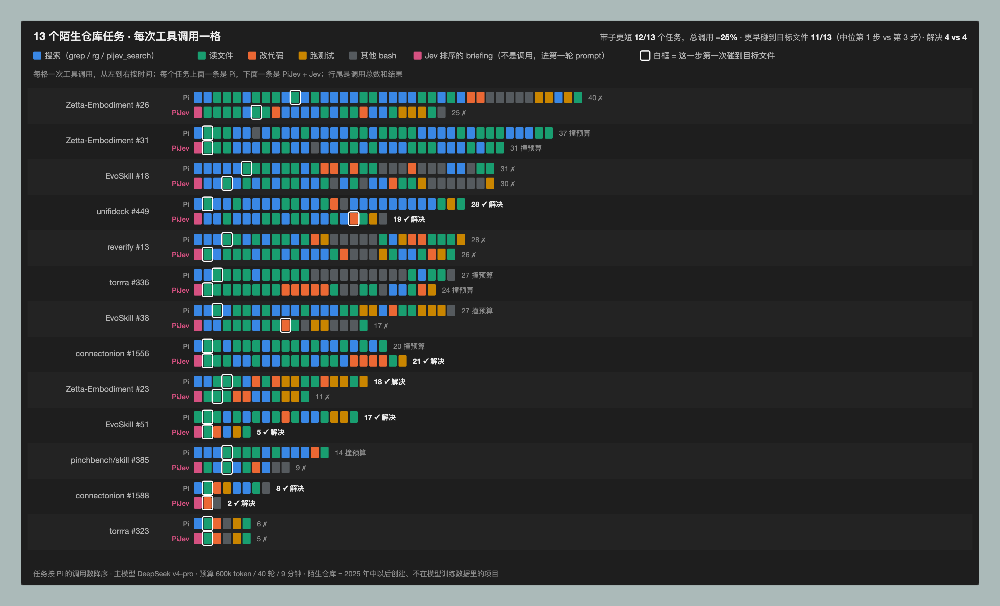
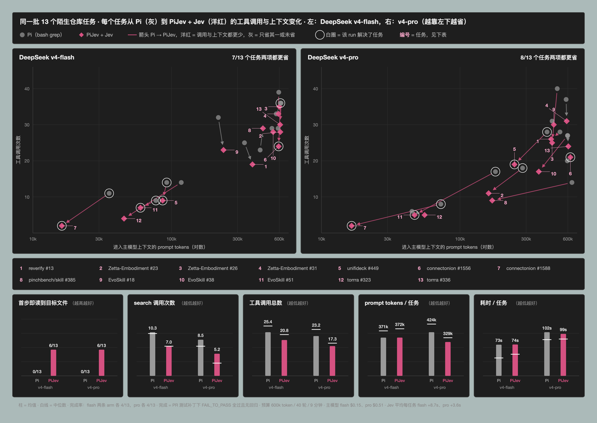
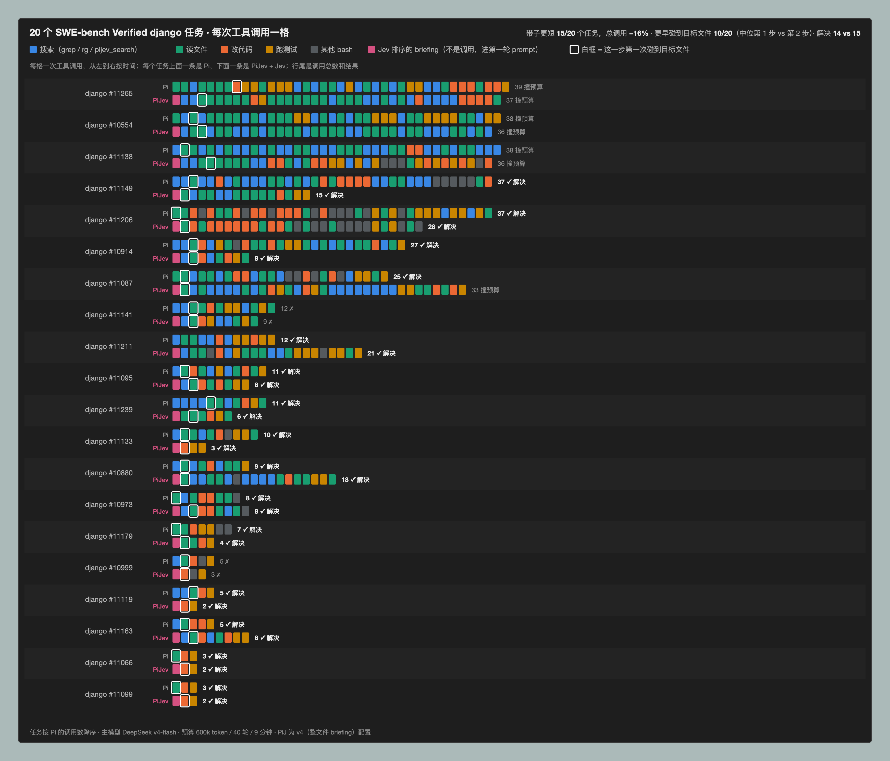

# PiJev

**把 Jev 接进编码流程：Jev 辅助决策，主模型推理与写代码。**

[English](README.md) | 简体中文

PiJev 是基于 [Pi](https://github.com/earendil-works/pi) 的终端 coding agent。它有独立的 `pijev` 命令、配置与会话目录，并把 [Jev](https://typesafe.ai/) 接入技能选择、源码搜索和失败诊断。当前版本为 **0.1.0，本地可运行**；尚未发布到 npm。

```text
  PiJev  v0.1.0   Fast judgment. Deliberate code.
  Jev decisions · Pi execution · your coding model

  /pijev status & modes    /model coding model    /login connect

  > Find why refresh tokens stop working after a session expires.
```

## 启动

需要 Node.js **22.19+**、npm 和 [ripgrep](https://github.com/BurntSushi/ripgrep)（`rg`，供 `pijev_search` 使用）。

```sh
git clone https://github.com/tonyzdev/pijev.git
cd PiJev
npm ci --ignore-scripts
npm run build
npm start
```

第一次启动后使用 `/login` 连接你的主模型，再用 `/model` 选择模型。PiJev 的主模型登录与 Pi 分开保存，不会自动导入 Pi 或 Codex 的凭据。

要启用 Jev，在启动进程的环境里设置 `TYPESAFE_API_KEY`。也可以复制 `.env.example` 为 `.env`，填入后运行：

```sh
node --env-file=.env bin/pijev.mjs
```

PiJev 不自动加载项目中的 `.env`。没有 Jev key 时，标准 coding agent 仍可使用已连接的主模型，Jev 判断会明确回退。

### 通过 Vercel AI Gateway 使用 Jev

[Jev 已上线 AI Gateway](https://vercel.com/changelog/typesafe-ai-jev-now-available-on-ai-gateway)。PiJev 支持官方 AI SDK 7 的实验性 `evaluate` API，模型为 `typesafe-ai/jev`。终端继续在本地运行，无需把 PiJev 部署到 Vercel。

在 `.env` 中配置以下变量，随后用上面的 `node --env-file` 命令启动：

```dotenv
PIJEV_JEV_PROVIDER=vercel
AI_GATEWAY_API_KEY=你的_Gateway_API_Key
```

只设置 Gateway key 时自动选择 Vercel；同时设置两种 key 时默认 TypeSafe 直连，用 `PIJEV_JEV_PROVIDER` 明确选择。两条路径的 key 不混用。Gateway 调用启用 `zeroDataRetention: true`、禁用 SDK 重试，并受相同的请求/响应大小和超时限制。Gateway 的账户、计费和访问资格仍由 Vercel 决定。

Pi 也支持用 `AI_GATEWAY_API_KEY` 连接生成式主模型：在 `/model` 中选择 `vercel-ai-gateway` 下的 coding model，即可共用 Gateway key。Jev 的 evaluation 调用与主模型的文本生成仍是两条独立流程；也可以让主模型继续使用其他提供商。

可选：将当前 checkout 安装为本地命令，之后在任意项目运行 `pijev`：

```sh
npm link --ignore-scripts
cd /path/to/your/project
pijev
```

## 实测

五组对照实验：20 次检索测量和 232 次 agent 运行，两组任务集都有 ground truth——参考补丁能让哪些测试从失败变通过。原版 Pi 和 PiJev 跑同一个任务、同一个主模型、同样的预算（600k token / 40 轮 / 9 分钟）和沙箱，唯一区别是 Jev。下面每一项比较都是按任务配对的。全部主模型花费约 $1.20；Jev 检索测量约 $0.35，agent 任务每题 $0.011–0.014。

| | SWE-bench Verified django · 20 题 · v4-flash | 陌生仓库 · 13 题 · v4-flash | 陌生仓库 · 13 题 · v4-pro |
|---|---:|---:|---:|
| **每题工具调用**（更少的任务数 · 符号检验） | −16%（15/20 · p = 0.02） | −18%（11/13 · p = 0.02） | **−25%**（12/13 · p = 0.003） |
| 每题搜索次数 | 4.6 → **3.5**（−24%） | 10.3 → **7.0**（−32%） | 8.5 → **5.2**（−39%） |
| 碰到补丁要改的文件的中位步数 | 2 → **1** | 4 → **1** | 3 → **1** |
| 第一次工具调用就打开该文件 ¹ | 5/20 → **10/20** | 0/13 → **7/13** | 0/13 → **7/13** |
| 每题 prompt token | 192k → 178k | 371k → 372k | 424k → **329k**（−22%） |
| 找到文件到第一次修改之间的调用 | — | 11.2 → 8.7 | 11.9 → **5.4** |
| 解决（Pi vs PiJev + Jev） | 15/20 vs 14/20 | 4/13 vs 4/13 | 4/13 vs 4/13 |

**把 46 对配对任务合在一起：PiJev + Jev 在 38 个任务上工具调用更少、7 个更多，精确符号检验 p = 3 × 10⁻⁶；工具调用总数减少 20%（bootstrap 95% 置信区间 11–28%）。** 每题一次运行不足以比较解决率，但足以得出这个结论。（`eval/figures/paired-stats.py` → `eval/swebench-agent-results/paired-stats.json`）

¹ 这一项部分是由设计决定的：briefing 已经点名了文件，第一步打开它说明模型信任 briefing。不受这一点影响的衡量是工具调用数。



*13 个 SWE-bench 风格任务，取自 2025 年中以后创建、不在主模型训练数据里的仓库的真实 PR；每题由原版 Pi 和 PiJev + Jev 各跑一次，主模型 deepseek-v4-pro。每格一次工具调用；白框 = 第一次读或改到参考补丁涉及的文件；粉块 = PiJev 在第一次调用前收到的 briefing。*

### Jev 改变了什么

**在第一次调用之前就把正确的文件放到模型面前。** 在仓库规模的语料上（django 各实例的 base commit，约 2,000 个 Python 文件），Jev 对 BM25 前 100 名重排后，参考补丁所改文件的 recall@1 从 0.25 升到 **0.74**，recall@10 从 0.74 升到 **0.96**；第一个目标文件的中位排名从 4 到 **1**，排在第 1 位的实例从 5/20 变为 17/20，没有任何实例变差。这不是"把测试文件往后排"的规则能解释的——Jev 的前 10 里测试文件反而比 BM25 *更多*，因为它把对应的测试留在实现旁边。整轮测量花 $0.35，没有调用任何主模型。（[细节](docs/swebench-retrieval-experiment.md)，英文）

**在任何模型都没见过的代码上同样成立。** 在一个私有的生产级 TypeScript monorepo 上（约 11.5 万行，创建时间晚于各模型的训练截止），取 24 个已合并的 PR：Jev 把 PR 要改的第一个文件排得比 BM25 更靠前的任务是 **24 个里的 24 个，没有一个更靠后**（精确符号检验 p = 1.2 × 10⁻⁷）；该文件的中位排名从 11 变成 **1**，排第 1 的有 17 个，BM25 是 0 个。查询用的是 PR 自己的描述，截掉验证记录并删掉所有文件路径；描述大多是中文，这对 BM25 的词匹配也是一种不利。仓库保持私有，只提交汇总数字。（[细节](docs/shortlist-and-private-repo.md)，英文）

**于是 agent 不再花调用去找它。** PiJev 里 Jev 相关度不低于 0.8 的首位文件会整篇进入第一轮 prompt。在模型没见过的仓库上，原版 Pi 第一步从不打开目标文件（0/13），中位要到第 3–4 步才碰到；PiJev + Jev 在 13 次里有 7 次第一步就打开了。grep 当然也能找到这些文件——晚一到三步，省下的正是这一到三步：搜索次数减少四分之一到五分之二。

**整条路径变短，主模型越强越明显。** 工具调用在 django 上减 16%，陌生仓库 v4-flash 减 18%、v4-pro 减 25%，更短的任务分别是 15/20、11/13、12/13。v4-pro 下，从找到文件到第一次修改的阶段减半（11.9 → 5.4 次），prompt token 减 22%——更强的模型直接按 briefing 行动，而不是自己再推导一遍；django 上有 5 个运行连一次 `read` 都没有就改了 briefing 给的文件。（[陌生仓库](docs/unfamiliar-repo-experiment.md) · [django](docs/swebench-agent-experiment.md)，英文）

**效果可归因、可复现。** 一条同样有 briefing 但用 BM25 而非 Jev 排序的对照臂落在两者之间（第一步打开目标文件：django 5 → 7 → 10，陌生仓库 0 → 2 → 6），说明收益来自排序本身，不是 briefing 这个形式。三次设计迭代里，努力类指标每次都朝同一个方向动（django 工具调用 16.1 → 14.8 → 14.3），这才让每题一次运行的数据能被解读。



*每个任务一支箭，从原版 Pi（灰）指向 PiJev + Jev（洋红），横轴 prompt token、纵轴工具调用；洋红箭头两项都更省，白圈是解决了的运行。下方柱状图在两个主模型上比较两条臂。*

### Jev（目前）没有改变什么

- **解决率。** 陌生仓库两个模型下都是 4 比 4，django 15 比 14——每题一次运行，这是噪声。13 个陌生仓库任务里有 8 个没有任何一条臂解出来：败在修复本身，不在找文件。Jev 缩短的是路径，不是结果。
- **DeepSeek 价位下的成本——现已减半。** 上面的 agent 实验里 Jev 每题 $0.011–0.014，是 deepseek-v4-flash 的 3–4 倍；而它省下的 prompt token 几乎不值钱：其中 94–95% 是 DeepSeek 缓存命中，每百万 $0.0028。Jev 的开销主要来自 briefing 给 BM25 前 100 个候选打分；在两组任务上做的 shortlist 消融显示，**50 个候选就能保住 100 个时的全部第 1 名结果，token 减半**，所以默认值已改成 50，Jev 每题约 $0.007–0.008——不到 v4-pro 主模型成本的一半，但仍高于 v4-flash。agent 实验还没有在 50 下重跑。（[消融](docs/shortlist-and-private-repo.md) · [前沿图与成本账](docs/unfamiliar-repo-experiment.md#the-frontier-drawn-honestly)，英文）
- **墙钟时间。** 陌生仓库持平（pro 下 Jev 每题多 3.6 秒），django 变慢（42 → 55 秒）。
- **证据规模。** 33 题，每种配置一次运行：够支撑努力类指标（显著，见上），不够比较差一题的结果指标。



全部可从仓库复现：harness（`eval/swebench-agent.ts`、`eval/swebench-retrieval.ts`）、陌生仓库任务的构造（`eval/unfamiliar/`）、每次运行的结果（`eval/swebench-agent-results/`）和画图脚本（`eval/figures/`）。完整记录（英文）：[检索召回](docs/swebench-retrieval-experiment.md) · [django agent](docs/swebench-agent-experiment.md) · [陌生仓库](docs/unfamiliar-repo-experiment.md) · [shortlist 大小与私有代码库](docs/shortlist-and-private-repo.md)。

## 三项 Jev 能力

**技能建议。** 每次用户请求开始时，Jev 根据请求筛选技能，再阅读最多三个候选的说明和指令片段，确认是否适用。主模型收到最多两个建议，完整技能目录仍保留。只处理允许模型调用的技能；超过 254 个候选时跳过推荐。技能判断具有建议性质，不保证主模型一定加载或正确使用它。

**源码搜索。** `pijev_search` 提供字面关键词时使用 ripgrep 检索；省略 `patterns` 时，根据自然语言问题扫描真实源码窗口，再让 Jev 排序。保留原文件路径、行号和原文；BM25 按整文件排序后取前 50 个交给 Jev 打分（每批不超过 32 KB），默认返回 8 个片段。自然语言扫描最多读取 20,000 个合规文件、每文件 256 KiB、总计 48 MiB，限时 8 秒，超出部分不被检索，结果中会注明。它不是全仓库语义索引。

**实验性源码摘录。** 设置 `PIJEV_SOURCE_BRIEFING=1` 后，每条新请求开始时自动提供最多三个文件的真实摘录；Jev 相关度不低于 0.8 且不超过 Pi 的 50 KB 读取上限的首位文件会整篇提供。`assist` 使用 Jev 排序；`off` 和 `observe` 使用 BM25。摘录是编辑前的快照，后续仍需核对当前源码。这项实验默认关闭；在上方[实测](#实测)里正是它让带子变短，但没有改变解决率。

**失败分流。** 工具返回错误后，Jev 判断更像代码、环境、依赖、网络、权限问题，还是无法判断，再附上固定的调查建议。每轮最多分析两个失败结果。原始错误和失败状态保留，不自动重试，不自动扩大权限。

Pi 的文件编辑、终端执行、流式输出、模型选择、OAuth/API key 登录、会话续接、分支和上下文压缩继续由锁定版本的 Pi SDK 提供。

## 命令

| 命令 | 用途 |
| --- | --- |
| `pijev` | 交互式 coding session |
| `pijev "任务"` | 带初始任务启动 |
| `pijev -p "任务"` | 一次运行并打印结果 |
| `pijev doctor` | 检查本地环境与凭据是否存在，不请求网络 |
| `pijev decisions` | 查看最近的决策元数据 |
| `pijev --jev-mode observe` | 以观察模式启动 |
| `pijev --pi-help` | 查看继承的 Pi 参数 |
| `/pijev` | 会话内状态和统计 |
| `/pijev decisions` | 会话内最近决策 |
| `/pijev assist` | 应用建议和搜索排序 |
| `/pijev observe` | 调用 Jev 并记录元数据，不应用结果 |
| `/pijev off` | 不请求 Jev |
| `/login`、`/model`、`/resume` | 主模型登录、选择、恢复会话 |

会话中的模式切换仅作用于当前运行实例；下次启动使用 `PIJEV_MODE` 或 `--jev-mode`。`observe` 仍会产生 Jev 请求与费用。

## 配置

| 环境变量 | 默认值 |
| --- | --- |
| `TYPESAFE_API_KEY` | 未设置，Jev 回退 |
| `AI_GATEWAY_API_KEY` | 未设置，供 Vercel 路径使用 |
| `PIJEV_JEV_PROVIDER` | `typesafe` 或 `vercel`，按上面的 key 规则自动选择 |
| `PIJEV_HOME` | `~/.pijev/agent` |
| `PIJEV_MODE` | `assist` |
| `PIJEV_JEV_MODEL` | TypeSafe：`jev-latest`；Vercel：`typesafe-ai/jev` |
| `PIJEV_JEV_TIMEOUT_MS` | `1800`，范围 50–30000 |
| `PIJEV_SOURCE_BRIEFING` | 实验性初始源码摘录：`0`（默认）或 `1` |
| `PIJEV_JEV_ENDPOINT` | TypeSafe：`https://api.typesafe.ai/v1/systemone`；Vercel：SDK base URL `https://ai-gateway.vercel.sh/v4/ai` |

主模型沿用 Pi 支持的提供商环境变量和 `/login`。全局认证、设置、技能、会话位于 PiJev home；项目仍兼容 Pi 的 `.pi/` 资源和 `AGENTS.md`。项目扩展加载保留 Pi 的信任机制。

## 数据与回退

- 在 `assist` 和 `observe` 模式下，当前请求、候选技能说明/指令片段、检索到的源码、失败工具输出可能发送到 TypeSafe；选择 Gateway 时通过 Vercel 转发。不开启无关后台扫描。
- `off` 不向 TypeSafe 发请求。它不会阻止主模型按正常 coding agent 流程接收上下文。
- Jev 每次调用有总超时、响应校验和取消机制；不做重试循环，只有 Gateway 以 5xx 拒绝的排序批次会重发一次。请求最多 90 KB，响应最多 1 MB；成功结果仅在内存中缓存五分钟、最多 128 项。连续三个计入的服务失败进入 30 秒冷却。
- 本地 `decisions/*.jsonl` 记录阶段、模式、耗时、token 数、缓存与回退状态，以及实际 Pi 会话 ID 和用户消息条目 ID（`sessionId` / `userMessageId`）。同一用户请求中的多次模型、工具回合保持相同用户消息 ID，旧日志仍可读取；不记录请求、答案、源码或工具日志。每个运行实例的日志上限 2 MB；历史文件由用户保留或删除。
- **Pi 的会话记录另行保存正常对话和工具内容**，上述“元数据”限制只适用于 PiJev 决策日志。
- 相关性分数和 confidence 都不是“代码正确率”。代码正确性仍依靠检查、编译、测试和实际验收。
- `pijev_search` 尊重 ignore 文件，并过滤隐藏文件、常见凭据文件、依赖与产物目录；`path` 只接受目录，`glob` 只能进一步缩小范围。为避免显式路径绕过 ignore 规则，检索从工作目录根开始；超出扫描上限时会明确提示。它不是秘密检测器，源码中硬编码的凭据不会被自动识别。

## 开发与验证

```sh
npm run check
npm test
npm run build
node bin/pijev.mjs doctor
```

测试使用本地 HTTP 服务替代远程模型；真实 Pi runtime 会运行搜索、失败工具和文件写入，验证三种模式的集成行为。测试不会请求真实模型或使用付费凭据。

见 [验证记录](docs/verification.md)、[产品设计](docs/design.md) 和 [实现计划](docs/implementation-plan.md)。真实 Jev 的鉴权、连通和响应格式已验证；完整任务的对照实验见[实测](#实测)：工具调用更少、更早找到文件，解决率持平，按 DeepSeek 价格成本尚未占优。

## 结构

```text
bin/pijev.mjs       CLI 入口
src/cli.ts        PiJev 命令与 Pi SDK 启动
src/extension.ts  会话、工具和界面集成
src/jev.ts        有界 Jev HTTP 客户端
src/gateway.ts    Vercel evaluation 协议适配
src/decisions.ts  技能、检索、失败判断
src/search.ts     源码检索与精确片段
src/telemetry.ts  本地决策元数据
test/            单元及真实 Pi runtime 集成测试
```

MIT license. Pi 及其他依赖保留各自许可证，见 [THIRD_PARTY_NOTICES.md](THIRD_PARTY_NOTICES.md)。
